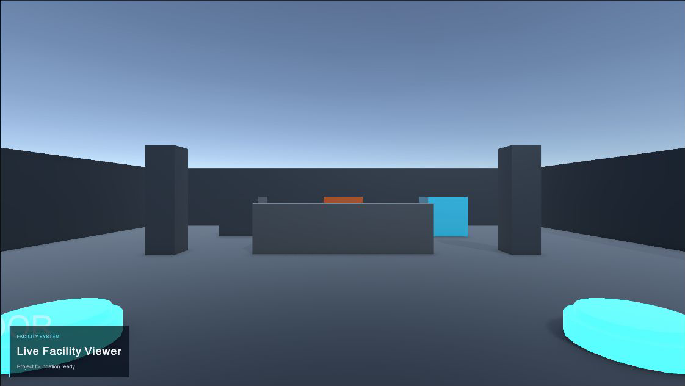
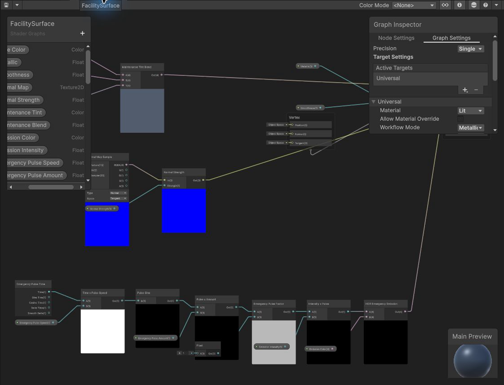
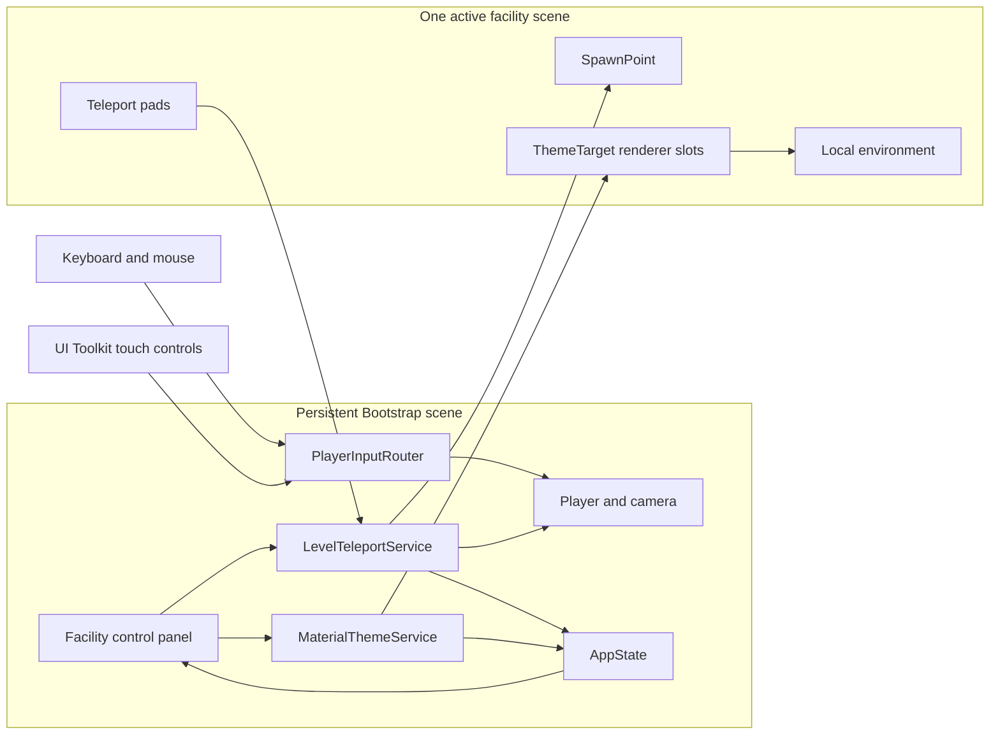
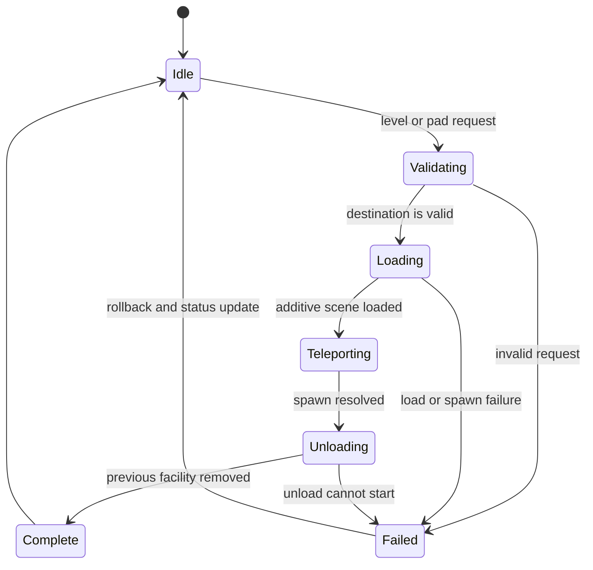

# Unity Live Facility Viewer

<p align="center">
  <strong>A Unity 6 URP facility viewer with first-person exploration, additive scene streaming, UI Toolkit controls, teleport-pad navigation, and runtime material themes.</strong>
</p>

<p align="center">
  
  
  
  
</p>

<p align="center">
  <a href="docs/images/facility-viewer-hero.png">
    
  </a>
</p>

Unity Live Facility Viewer is a compact 3D operations environment built around a persistent application shell. The player can explore three streamed facility areas, move between them from a responsive control panel or in-world teleport pads, and apply Standard, Maintenance, or Emergency material themes without rebuilding the scenes.

The project focuses on explicit ownership: Bootstrap keeps application state, services, player input, camera, and UI alive while each facility scene owns only its local environment, spawn points, teleport pads, and theme targets.

## Experience highlights

- First-person movement with keyboard, mouse, and UI Toolkit touch controls feeding one input router
- Persistent Bootstrap scene with Lobby, Operations Floor, and Plant Room loaded additively
- Responsive UI Toolkit facility panel with loading, selected, disabled, success, and error states
- In-world teleport pads routed through the same guarded transition service as panel navigation
- Stable spawn identifiers, overlap rejection, and rollback when a destination cannot complete
- URP `FacilitySurface` Shader Graph with exposed surface, maintenance tint, and emergency pulse controls
- Data-driven Standard, Maintenance, and Emergency themes across structure and equipment groups
- Intentional use of saved shared materials, per-renderer property blocks, and one owned runtime material instance

## Visual showcase

<table>
  <tr>
    <td width="56%">
      <a href="docs/images/facility-viewer-hero.png"></a>
    </td>
    <td width="44%">
      <a href="docs/images/facility-surface-graph.png"></a>
    </td>
  </tr>
  <tr>
    <td align="center">Runtime facility view</td>
    <td align="center">Inspectable Shader Graph</td>
  </tr>
</table>

The Lobby includes a deliberately small material-ownership comparison: one saved shared material, one `MaterialPropertyBlock` override, and one explicitly owned runtime instance. Native Frame Debugger inspection resolves the three opaque comparison draws as two SRP-batched draws and one regular draw.

## Runtime architecture



### Facility transition flow



## Controls

| Action | Desktop | Touch |
| --- | --- | --- |
| Move | WASD or arrow keys | Virtual joystick |
| Look | Mouse | Look region |
| Sprint | Left Shift | — |
| Use teleport pad | E | `USE` |
| Open control panel | Tab | `PANEL` |
| Return to gameplay | Tab | `RETURN` |

## Technology

- Unity 6.5, editor version `6000.5.9f1`
- Universal Render Pipeline and Shader Graph `17.5.0`
- Input System `1.20.0`
- UI Toolkit runtime interface, mobile controls, UXML, and USS
- C# services, MonoBehaviours, and ScriptableObject configuration
- Unity Test Framework Edit Mode and Play Mode suites
- Memory Profiler `1.1.9`
- Windows development build profile; Android development profile prepared

## Repository map

| Path | Responsibility |
| --- | --- |
| `Portal-Test/Assets/Scenes/` | Bootstrap and the three streamed facility scenes |
| `Portal-Test/Assets/Scripts/Core/` | Application state, startup composition, and stable identifiers |
| `Portal-Test/Assets/Scripts/Player/` | Movement, unified input routing, and teleport-pad interaction |
| `Portal-Test/Assets/Scripts/Services/` | Additive transitions and runtime material themes |
| `Portal-Test/Assets/Scripts/UI/` | UI Toolkit presenters, view contracts, and input handoff |
| `Portal-Test/Assets/Scripts/World/` | Spawn points, teleport pads, theme targets, and material ownership examples |
| `Portal-Test/Assets/Art/` | Facility Shader Graphs and saved material variants |
| `Portal-Test/Assets/Data/` | Level, player, and theme definitions |
| `Portal-Test/Assets/UI/` | Runtime UXML documents, templates, and USS styles |
| `Portal-Test/Assets/Tests/` | Shared test assets and fixtures |
| `Portal-Test/Assets/Scripts/Tests/` | Edit Mode and Play Mode verification |
| `Portal-Test/Assets/Settings/BuildProfiles/` | Windows and Android build profiles |

## Getting started

### Requirements

- Unity Hub
- Unity `6000.5.9f1`
- Windows Build Support for a Windows player build

### Open the project

```bash
git clone https://github.com/Elia-Youssef/unity-live-facility-viewer.git
```

1. Add the cloned `Portal-Test/` directory to Unity Hub.
2. Open it with Unity `6000.5.9f1`.
3. Allow package import and script compilation to finish.
4. Open `Assets/Scenes/Bootstrap.unity`.
5. Enter Play Mode. Bootstrap loads Lobby additively and activates the persistent player after resolving its `entrance` spawn.

## Testing and building

Open **Window > General > Test Runner** and run both project suites:

| Suite | Verified result |
| --- | ---: |
| Edit Mode | 69 / 69 passing |
| Play Mode | 27 / 27 passing |

For a Windows build, open **File > Build Profiles**, select **Windows Development**, and build to a local directory. The profile includes the production scenes in this order:

1. Bootstrap
2. Lobby
3. Operations Floor
4. Plant Room

The current Windows development checkpoint builds and launches successfully. The Android profile is authored, but Android Build Support, SDK/NDK tools, Java toolchain, build output, and device validation remain pending.

## Current scope

Implemented and verified:

- Windows and Editor project foundation
- Unified desktop and touch-oriented input
- Persistent Bootstrap composition and additive facility transitions
- Responsive UI Toolkit control panel
- Explicit-use teleport pads
- Shader Graph material themes and material-ownership profiling

Next planned areas:

- Facility light groups and control-panel integration
- Android toolchain installation, build, and device validation
- Deployed performance baseline and evidence-based optimization
- Final end-to-end platform validation

Live services, authentication, networking, and sensor integration are intentionally outside the current scope. The service and state boundaries are designed so those sources can be added without moving scene loading, material writes, or player ownership into UI callbacks.
